# MGSearch - Visual Architecture Diagrams

This document contains Mermaid diagrams for visualizing the MGSearch architecture. These diagrams can be rendered in GitHub, GitLab, or any Markdown viewer that supports Mermaid.

## Table of Contents
1. [System Architecture](#system-architecture)
2. [Data Model Relationships](#data-model-relationships)
3. [Authentication Flow - SaaS](#authentication-flow---saas)
4. [Authentication Flow - Shopify](#authentication-flow---shopify)
5. [Search Flow - SaaS](#search-flow---saas)
6. [Search Flow - Storefront](#search-flow---storefront)
7. [Webhook Processing Flow](#webhook-processing-flow)
8. [Component Dependencies](#component-dependencies)

---

## System Architecture

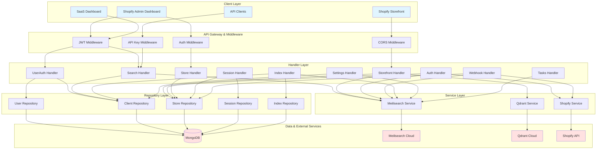

---

## Data Model Relationships

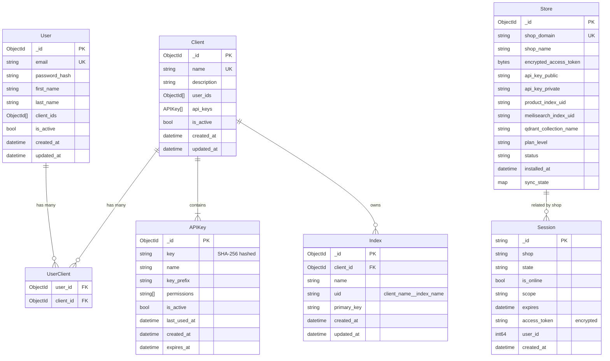

---

## Authentication Flow - SaaS

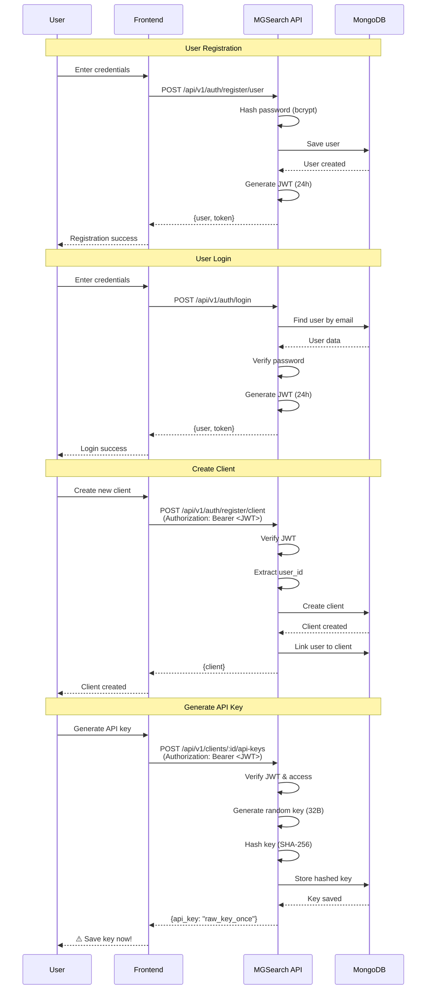

---

## Authentication Flow - Shopify

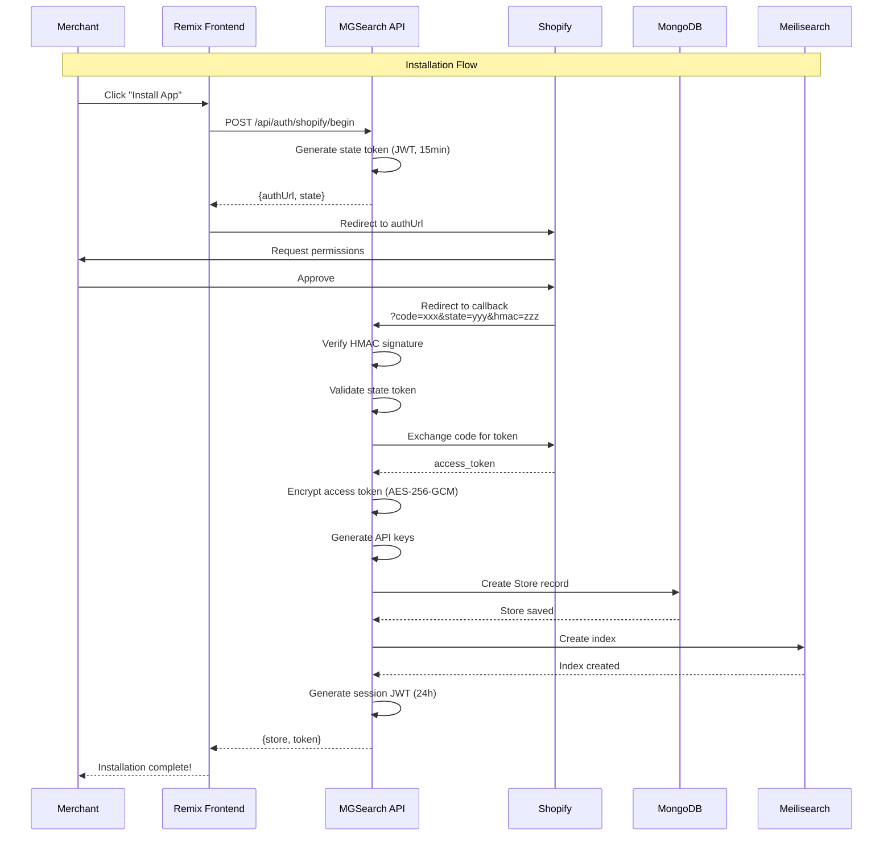

---

## Search Flow - SaaS

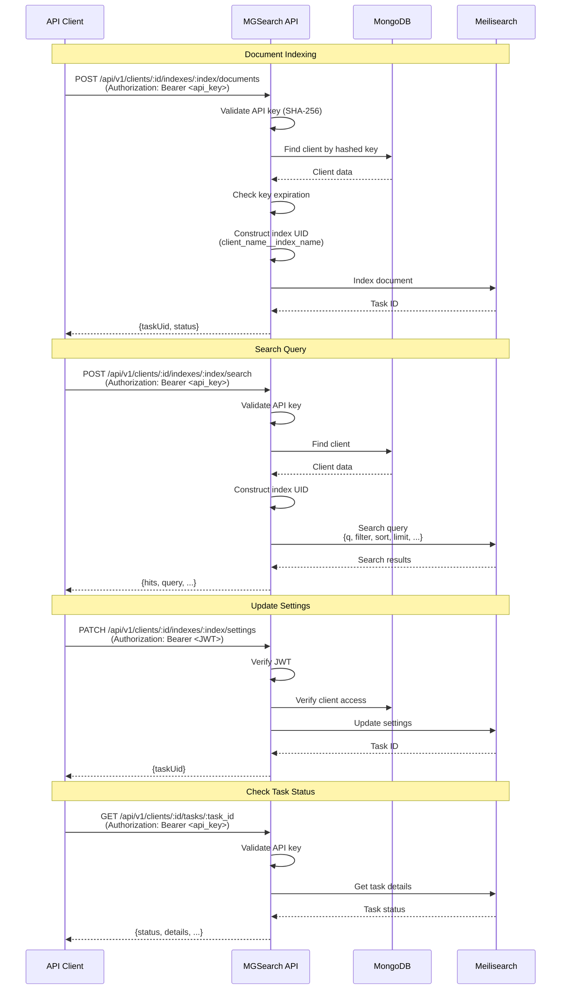

---

## Search Flow - Storefront

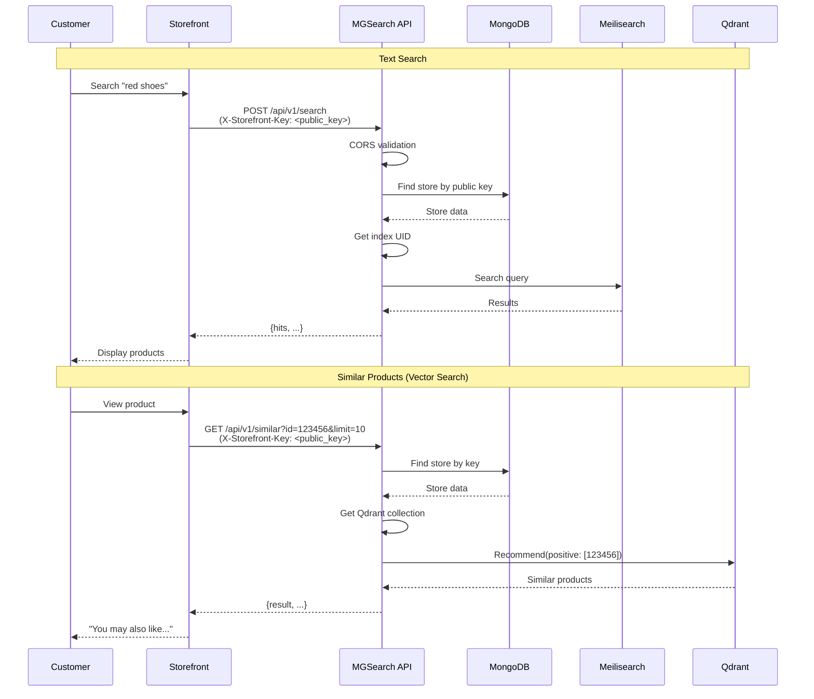

---

## Webhook Processing Flow

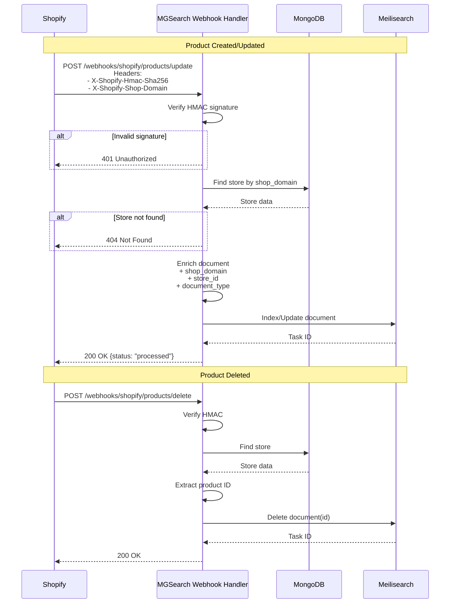

---

## Component Dependencies

```mermaid
graph TD
    subgraph "Main Application"
        Main[main.go]
    end
    
    subgraph "Configuration"
        Config[config/config.go]
    end
    
    subgraph "Handlers"
        H1[UserAuthHandler]
        H2[SearchHandler]
        H3[StorefrontHandler]
        H4[AuthHandler]
        H5[StoreHandler]
        H6[SessionHandler]
        H7[WebhookHandler]
        H8[IndexHandler]
        H9[SettingsHandler]
        H10[TasksHandler]
    end
    
    subgraph "Middleware"
        MW1[JWTMiddleware]
        MW2[APIKeyMiddleware]
        MW3[AuthMiddleware]
        MW4[CORSMiddleware]
    end
    
    subgraph "Services"
        S1[MeilisearchService]
        S2[QdrantService]
        S3[ShopifyService]
    end
    
    subgraph "Repositories"
        R1[UserRepository]
        R2[ClientRepository]
        R3[StoreRepository]
        R4[SessionRepository]
        R5[IndexRepository]
    end
    
    subgraph "Models"
        M1[User]
        M2[Client]
        M3[Store]
        M4[Session]
        M5[Index]
        M6[Search]
    end
    
    subgraph "Security"
        Sec1[JWT Utils]
        Sec2[Password Utils]
        Sec3[Encryption Utils]
        Sec4[Key Generation]
    end
    
    Main --> Config
    Main --> MW1 & MW2 & MW3 & MW4
    Main --> H1 & H2 & H3 & H4 & H5 & H6 & H7 & H8 & H9 & H10
    Main --> S1 & S2 & S3
    Main --> R1 & R2 & R3 & R4 & R5
    
    H1 --> R1 & R2
    H1 --> Sec1 & Sec2
    
    H2 --> R2 & S1
    
    H3 --> R3 & S1 & S2
    
    H4 --> R3 & S1 & S3
    H4 --> Sec3 & Sec4 & Sec1
    
    H5 --> R3
    
    H6 --> R3 & R4 & S1
    H6 --> Sec3
    
    H7 --> R3 & S1 & S3
    
    H8 --> R2 & R5 & S1
    
    H9 --> R2 & S1
    
    H10 --> S1
    
    MW1 --> Sec1
    MW2 --> R2
    MW3 --> Sec1
    
    R1 & R2 & R3 & R4 & R5 --> M1 & M2 & M3 & M4 & M5
    
    H2 & H3 & H9 & H10 --> M6
    
    style Main fill:#ffd700
    style Config fill:#98fb98
    style S1 fill:#ffb6c1
    style S2 fill:#ffb6c1
    style S3 fill:#ffb6c1
```

---

## API Endpoint Tree

```mermaid
graph TD
    Root[MGSearch API]
    
    Root --> Public[Public Endpoints]
    Root --> SaaS[SaaS Platform]
    Root --> Shopify[Shopify Platform]
    Root --> Webhooks[Webhooks]
    
    Public --> Ping[GET /ping]
    
    SaaS --> Auth[Authentication]
    SaaS --> Clients[Client Management]
    SaaS --> Search[Search Operations]
    
    Auth --> RegUser[POST /auth/register/user]
    Auth --> Login[POST /auth/login]
    Auth --> Me[GET /auth/me]
    Auth --> UpdateUser[PUT /auth/user]
    Auth --> RegClient[POST /auth/register/client]
    
    Clients --> ListClients[GET /clients]
    Clients --> GetClient[GET /clients/:id]
    Clients --> GenKey[POST /clients/:id/api-keys]
    Clients --> RevokeKey[DELETE /clients/:id/api-keys/:key]
    Clients --> CreateIndex[POST /clients/:id/indexes]
    Clients --> ListIndexes[GET /clients/:id/indexes]
    Clients --> IndexDoc[POST /clients/:id/indexes/:idx/documents]
    Clients --> UpdateSettings[PATCH /clients/:id/indexes/:idx/settings]
    
    Search --> ClientSearch[POST /clients/:id/indexes/:idx/search]
    Search --> TaskStatus[GET /clients/:id/tasks/:task_id]
    
    Shopify --> StorefrontSearch[Storefront Search]
    Shopify --> ShopifyAuth[OAuth Flow]
    Shopify --> StoreManagement[Store Management]
    Shopify --> Sessions[Session Management]
    
    StorefrontSearch --> SearchProducts[GET/POST /search]
    StorefrontSearch --> SimilarProducts[GET/POST /similar]
    
    ShopifyAuth --> BeginAuth[POST /auth/shopify/begin]
    ShopifyAuth --> Callback[GET /auth/shopify/callback]
    ShopifyAuth --> Exchange[POST /auth/shopify/exchange]
    ShopifyAuth --> Install[POST /auth/shopify/install]
    
    StoreManagement --> CurrentStore[GET /stores/current]
    StoreManagement --> SyncStatus[GET /stores/sync-status]
    
    Sessions --> StoreSession[POST /sessions]
    Sessions --> LoadSession[GET /sessions/:id]
    Sessions --> DeleteSession[DELETE /sessions/:id]
    Sessions --> BatchDelete[DELETE /sessions/batch]
    Sessions --> FindByShop[GET /sessions/shop/:shop]
    
    Webhooks --> ProductWebhook[POST /webhooks/shopify/:topic/:subtopic]
    
    style Root fill:#4169e1,color:#fff
    style Public fill:#90ee90
    style SaaS fill:#ffa07a
    style Shopify fill:#87ceeb
    style Webhooks fill:#dda0dd
```

---

## Security & Authentication Matrix

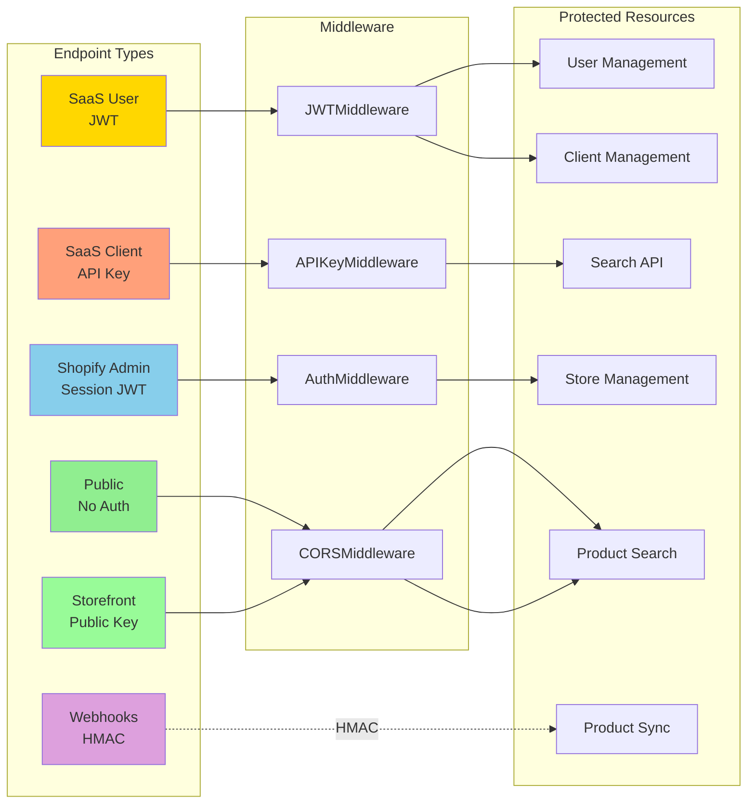

---

## Data Flow - End to End

### SaaS Platform Flow

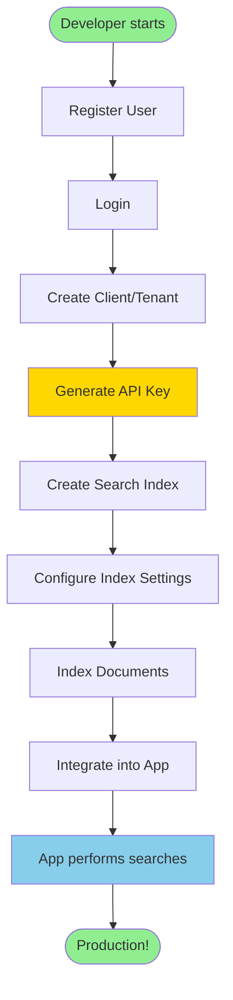

### Shopify Platform Flow

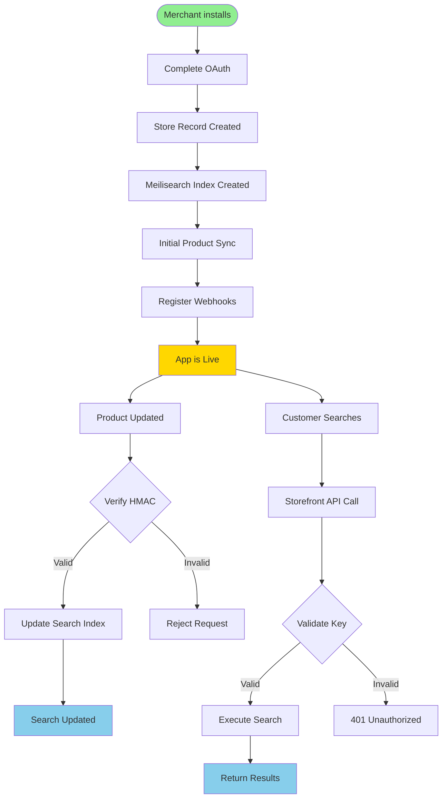

---

## Deployment Architecture

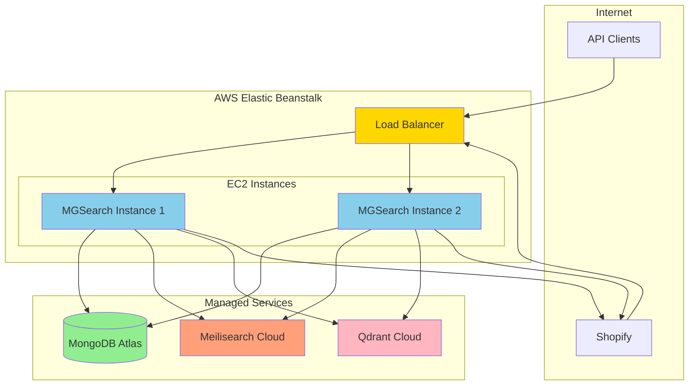

---

**Note:** These diagrams are created using Mermaid syntax and can be rendered in:
- GitHub
- GitLab
- VS Code (with Mermaid extension)
- Markdown preview tools
- Mermaid Live Editor (https://mermaid.live)

**Generated:** 2026-01-15
**Version:** Current main branch
